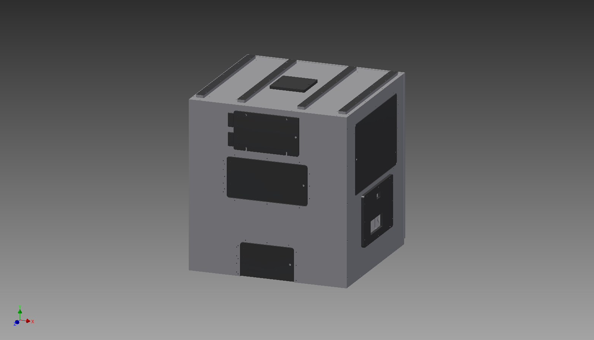
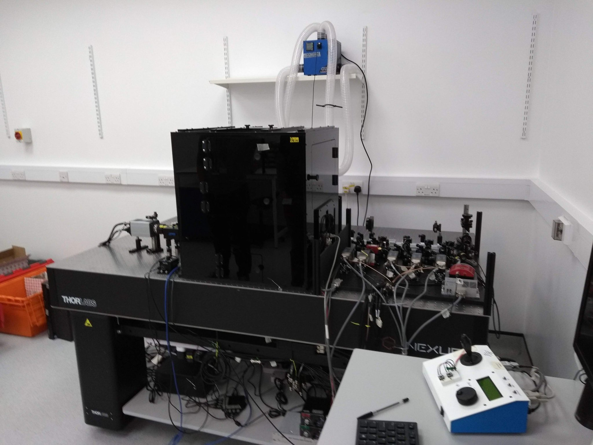

Microscope incubation box for home built single molecule microscope.
Designed in AutoDesk CAD software.

Designed by Dr Yann Cesbron, Holden Lab

We heat this system with a high precision temperature control system, "The Cube" from http://lis.ch/, which we have found to be stabe to < 0.1C.

The body plastic is 10mm Black 9961 Perspex and the Front Panel Top Window is 10mm Clear Perspex.

Fabrication was by a local company, Bay Plastics Ltd, North Shields, UK and cost £1350 inc. materials. 

See LICENSE.txt for license information.

